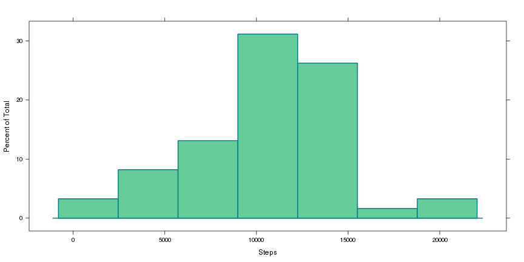

<link rel="stylesheet" type="text/css", href="styles/styles.css"/>

# Reproducible Research: Peer Assessment 1
<hr/>

## Loading and preprocessing the data

- **Load the data (and packages)**

```r
library(xtable)
library(lattice)
library(dplyr)

data <- read.csv("data/activity.csv", header = T)
```

- **Transform and display data**

```r
head.data = xtable(head(data))
tail.data = xtable(tail(data))

print.xtable(head.data, type = 'html', include.rownames = F)
```

<!-- html table generated in R 3.0.3 by xtable 1.7-3 package -->
<!-- Sat Jul 19 13:53:16 2014 -->
<TABLE border=1>
<TR> <TH> steps </TH> <TH> date </TH> <TH> interval </TH>  </TR>
  <TR> <TD align="right">  </TD> <TD> 2012-10-01 </TD> <TD align="right">   0 </TD> </TR>
  <TR> <TD align="right">  </TD> <TD> 2012-10-01 </TD> <TD align="right">   5 </TD> </TR>
  <TR> <TD align="right">  </TD> <TD> 2012-10-01 </TD> <TD align="right">  10 </TD> </TR>
  <TR> <TD align="right">  </TD> <TD> 2012-10-01 </TD> <TD align="right">  15 </TD> </TR>
  <TR> <TD align="right">  </TD> <TD> 2012-10-01 </TD> <TD align="right">  20 </TD> </TR>
  <TR> <TD align="right">  </TD> <TD> 2012-10-01 </TD> <TD align="right">  25 </TD> </TR>
   </TABLE>

```r
print.xtable(tail.data, type = 'html', include.rownames = F)
```

<!-- html table generated in R 3.0.3 by xtable 1.7-3 package -->
<!-- Sat Jul 19 13:53:16 2014 -->
<TABLE border=1>
<TR> <TH> steps </TH> <TH> date </TH> <TH> interval </TH>  </TR>
  <TR> <TD align="right">  </TD> <TD> 2012-11-30 </TD> <TD align="right"> 2330 </TD> </TR>
  <TR> <TD align="right">  </TD> <TD> 2012-11-30 </TD> <TD align="right"> 2335 </TD> </TR>
  <TR> <TD align="right">  </TD> <TD> 2012-11-30 </TD> <TD align="right"> 2340 </TD> </TR>
  <TR> <TD align="right">  </TD> <TD> 2012-11-30 </TD> <TD align="right"> 2345 </TD> </TR>
  <TR> <TD align="right">  </TD> <TD> 2012-11-30 </TD> <TD align="right"> 2350 </TD> </TR>
  <TR> <TD align="right">  </TD> <TD> 2012-11-30 </TD> <TD align="right"> 2355 </TD> </TR>
   </TABLE>


## What is mean total number of steps taken per day?

- **Make a histogram of the total number of steps taken each day**

--**Getting total of steps by day**

```r
total.steps <- aggregate(data$steps, by=list(as.Date(data$date)), FUN=sum)
names(total.steps) <- c("Date", "Total")
total.steps$Date <- as.character(total.steps$Date)
```

--**Plotting data**

```r
histogram( ~ Total, data = total.steps, xlab = "Steps", main = NA,
			panel = function(x, ...) {
				panel.histogram(x, col = "#66CC99", border = "#008080", lwd = 2, ...)
			}
		)
```

 

- **Calculate and report the _mean_ and _median_ total number of steps taken per day**

-- **Getting the Mean**

```r
mean.steps <- aggregate(data$steps, by=list(as.Date(data$date)), FUN=mean)
```

-- **Adding Median**

```r
mean.steps$Median <- aggregate(data$steps, by=list(as.Date(data$date)), FUN=median)[,2]
names(mean.steps) <- c("Date", "Mean", "Median")
mean.steps$Date <- as.character(mean.steps$Date)
```

-- **Printing table**

```r
print.xtable(xtable(mean.steps), type='html', include.rownames = F,
			 html.table.attributes="id='mean-median'")
```

<!-- html table generated in R 3.0.3 by xtable 1.7-3 package -->
<!-- Sat Jul 19 13:53:17 2014 -->
<TABLE id='mean-median'>
<TR> <TH> Date </TH> <TH> Mean </TH> <TH> Median </TH>  </TR>
  <TR> <TD> 2012-10-01 </TD> <TD align="right">  </TD> <TD align="right">  </TD> </TR>
  <TR> <TD> 2012-10-02 </TD> <TD align="right"> 0.44 </TD> <TD align="right"> 0.00 </TD> </TR>
  <TR> <TD> 2012-10-03 </TD> <TD align="right"> 39.42 </TD> <TD align="right"> 0.00 </TD> </TR>
  <TR> <TD> 2012-10-04 </TD> <TD align="right"> 42.07 </TD> <TD align="right"> 0.00 </TD> </TR>
  <TR> <TD> 2012-10-05 </TD> <TD align="right"> 46.16 </TD> <TD align="right"> 0.00 </TD> </TR>
  <TR> <TD> 2012-10-06 </TD> <TD align="right"> 53.54 </TD> <TD align="right"> 0.00 </TD> </TR>
  <TR> <TD> 2012-10-07 </TD> <TD align="right"> 38.25 </TD> <TD align="right"> 0.00 </TD> </TR>
  <TR> <TD> 2012-10-08 </TD> <TD align="right">  </TD> <TD align="right">  </TD> </TR>
  <TR> <TD> 2012-10-09 </TD> <TD align="right"> 44.48 </TD> <TD align="right"> 0.00 </TD> </TR>
  <TR> <TD> 2012-10-10 </TD> <TD align="right"> 34.38 </TD> <TD align="right"> 0.00 </TD> </TR>
  <TR> <TD> 2012-10-11 </TD> <TD align="right"> 35.78 </TD> <TD align="right"> 0.00 </TD> </TR>
  <TR> <TD> 2012-10-12 </TD> <TD align="right"> 60.35 </TD> <TD align="right"> 0.00 </TD> </TR>
  <TR> <TD> 2012-10-13 </TD> <TD align="right"> 43.15 </TD> <TD align="right"> 0.00 </TD> </TR>
  <TR> <TD> 2012-10-14 </TD> <TD align="right"> 52.42 </TD> <TD align="right"> 0.00 </TD> </TR>
  <TR> <TD> 2012-10-15 </TD> <TD align="right"> 35.20 </TD> <TD align="right"> 0.00 </TD> </TR>
  <TR> <TD> 2012-10-16 </TD> <TD align="right"> 52.38 </TD> <TD align="right"> 0.00 </TD> </TR>
  <TR> <TD> 2012-10-17 </TD> <TD align="right"> 46.71 </TD> <TD align="right"> 0.00 </TD> </TR>
  <TR> <TD> 2012-10-18 </TD> <TD align="right"> 34.92 </TD> <TD align="right"> 0.00 </TD> </TR>
  <TR> <TD> 2012-10-19 </TD> <TD align="right"> 41.07 </TD> <TD align="right"> 0.00 </TD> </TR>
  <TR> <TD> 2012-10-20 </TD> <TD align="right"> 36.09 </TD> <TD align="right"> 0.00 </TD> </TR>
  <TR> <TD> 2012-10-21 </TD> <TD align="right"> 30.63 </TD> <TD align="right"> 0.00 </TD> </TR>
  <TR> <TD> 2012-10-22 </TD> <TD align="right"> 46.74 </TD> <TD align="right"> 0.00 </TD> </TR>
  <TR> <TD> 2012-10-23 </TD> <TD align="right"> 30.97 </TD> <TD align="right"> 0.00 </TD> </TR>
  <TR> <TD> 2012-10-24 </TD> <TD align="right"> 29.01 </TD> <TD align="right"> 0.00 </TD> </TR>
  <TR> <TD> 2012-10-25 </TD> <TD align="right"> 8.65 </TD> <TD align="right"> 0.00 </TD> </TR>
  <TR> <TD> 2012-10-26 </TD> <TD align="right"> 23.53 </TD> <TD align="right"> 0.00 </TD> </TR>
  <TR> <TD> 2012-10-27 </TD> <TD align="right"> 35.14 </TD> <TD align="right"> 0.00 </TD> </TR>
  <TR> <TD> 2012-10-28 </TD> <TD align="right"> 39.78 </TD> <TD align="right"> 0.00 </TD> </TR>
  <TR> <TD> 2012-10-29 </TD> <TD align="right"> 17.42 </TD> <TD align="right"> 0.00 </TD> </TR>
  <TR> <TD> 2012-10-30 </TD> <TD align="right"> 34.09 </TD> <TD align="right"> 0.00 </TD> </TR>
  <TR> <TD> 2012-10-31 </TD> <TD align="right"> 53.52 </TD> <TD align="right"> 0.00 </TD> </TR>
  <TR> <TD> 2012-11-01 </TD> <TD align="right">  </TD> <TD align="right">  </TD> </TR>
  <TR> <TD> 2012-11-02 </TD> <TD align="right"> 36.81 </TD> <TD align="right"> 0.00 </TD> </TR>
  <TR> <TD> 2012-11-03 </TD> <TD align="right"> 36.70 </TD> <TD align="right"> 0.00 </TD> </TR>
  <TR> <TD> 2012-11-04 </TD> <TD align="right">  </TD> <TD align="right">  </TD> </TR>
  <TR> <TD> 2012-11-05 </TD> <TD align="right"> 36.25 </TD> <TD align="right"> 0.00 </TD> </TR>
  <TR> <TD> 2012-11-06 </TD> <TD align="right"> 28.94 </TD> <TD align="right"> 0.00 </TD> </TR>
  <TR> <TD> 2012-11-07 </TD> <TD align="right"> 44.73 </TD> <TD align="right"> 0.00 </TD> </TR>
  <TR> <TD> 2012-11-08 </TD> <TD align="right"> 11.18 </TD> <TD align="right"> 0.00 </TD> </TR>
  <TR> <TD> 2012-11-09 </TD> <TD align="right">  </TD> <TD align="right">  </TD> </TR>
  <TR> <TD> 2012-11-10 </TD> <TD align="right">  </TD> <TD align="right">  </TD> </TR>
  <TR> <TD> 2012-11-11 </TD> <TD align="right"> 43.78 </TD> <TD align="right"> 0.00 </TD> </TR>
  <TR> <TD> 2012-11-12 </TD> <TD align="right"> 37.38 </TD> <TD align="right"> 0.00 </TD> </TR>
  <TR> <TD> 2012-11-13 </TD> <TD align="right"> 25.47 </TD> <TD align="right"> 0.00 </TD> </TR>
  <TR> <TD> 2012-11-14 </TD> <TD align="right">  </TD> <TD align="right">  </TD> </TR>
  <TR> <TD> 2012-11-15 </TD> <TD align="right"> 0.14 </TD> <TD align="right"> 0.00 </TD> </TR>
  <TR> <TD> 2012-11-16 </TD> <TD align="right"> 18.89 </TD> <TD align="right"> 0.00 </TD> </TR>
  <TR> <TD> 2012-11-17 </TD> <TD align="right"> 49.79 </TD> <TD align="right"> 0.00 </TD> </TR>
  <TR> <TD> 2012-11-18 </TD> <TD align="right"> 52.47 </TD> <TD align="right"> 0.00 </TD> </TR>
  <TR> <TD> 2012-11-19 </TD> <TD align="right"> 30.70 </TD> <TD align="right"> 0.00 </TD> </TR>
  <TR> <TD> 2012-11-20 </TD> <TD align="right"> 15.53 </TD> <TD align="right"> 0.00 </TD> </TR>
  <TR> <TD> 2012-11-21 </TD> <TD align="right"> 44.40 </TD> <TD align="right"> 0.00 </TD> </TR>
  <TR> <TD> 2012-11-22 </TD> <TD align="right"> 70.93 </TD> <TD align="right"> 0.00 </TD> </TR>
  <TR> <TD> 2012-11-23 </TD> <TD align="right"> 73.59 </TD> <TD align="right"> 0.00 </TD> </TR>
  <TR> <TD> 2012-11-24 </TD> <TD align="right"> 50.27 </TD> <TD align="right"> 0.00 </TD> </TR>
  <TR> <TD> 2012-11-25 </TD> <TD align="right"> 41.09 </TD> <TD align="right"> 0.00 </TD> </TR>
  <TR> <TD> 2012-11-26 </TD> <TD align="right"> 38.76 </TD> <TD align="right"> 0.00 </TD> </TR>
  <TR> <TD> 2012-11-27 </TD> <TD align="right"> 47.38 </TD> <TD align="right"> 0.00 </TD> </TR>
  <TR> <TD> 2012-11-28 </TD> <TD align="right"> 35.36 </TD> <TD align="right"> 0.00 </TD> </TR>
  <TR> <TD> 2012-11-29 </TD> <TD align="right"> 24.47 </TD> <TD align="right"> 0.00 </TD> </TR>
  <TR> <TD> 2012-11-30 </TD> <TD align="right">  </TD> <TD align="right">  </TD> </TR>
   </TABLE>

## What is the average daily activity pattern?

- **Make a time series plot (i.e. `type = "l"`) of the 5-minute interval (x-axis) and the average number of steps taken, averaged across all days (y-axis)**

-- **Getting averaged steps**

```r
interval.data <- aggregate(data$steps, by=list(data$interval), FUN=mean, na.rm=T)
names(interval.data) <- c("Interval", "Steps")
```

-- **Ploting time serie**

```r
xyplot(Steps ~ Interval, data = interval.data, type = 'l',
			panel = function(x, ...) {
				panel.xyplot(x, col = "#008080", lwd = 2, ...)
			}
		)
```

 

- **Which 5-minute interval, on average across all the days in the dataset, contains the maximum number of steps?**

-- **Getting row ubication of maximum number of steps**

```r
max.steps <- interval.data[which.max(interval.data$Steps),]
```

-- **Answer**: 5-minute interval containig the maximum number (206.2) of steps is 835.


## Imputing missing values

- **Calculate and report the total number of missing values in the dataset (i.e. the total number of rows with `NAs`)**

-- **Getting rows with only `NAs` from main data set**

```r
na.data <- subset(data, is.na(steps))
```

-- **Count of missing values**: 2304.

- **Devise a strategy for filling in all of the missing values in the dataset. The strategy does not need to be sophisticated. 
For example, you could use the mean/median for that day, or the mean for that 5-minute interval, etc.**

- **Create a new dataset that is equal to the original dataset but with the missing data filled in.**

-- **Filling `Na's` values with the mean for that corresponding day.**


```r
new.data <- data
for(i in new.data$date){
	rows.na <- filter(new.data, date == i & is.na(steps))
	rows <- filter(new.data, date == i & !is.na(steps))
	rows.mean <- filter(mean.steps, Date == i)
	rows.na$steps <- rep(rows.mean$Mean, nrow(rows.na))
	
	#day <- paste(strsplit(i,"-")[[1]][c(2, 3)], collapse = "")
	#assign(cbind(rows,rows.na), day)
}
```

- **Make a histogram of the total number of steps taken each day and Calculate and report the mean and median total number of 
steps taken per day. Do these values differ from the estimates from the first part of the assignment? What is the impact of 
imputing missing data on the estimates of the total daily number of steps?**
